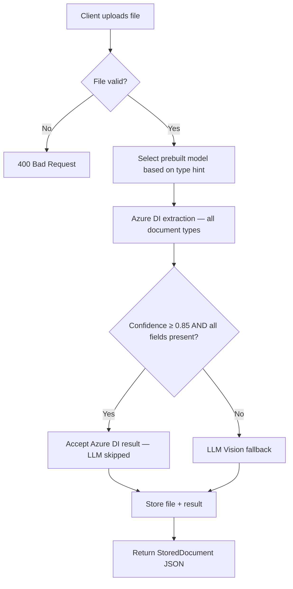
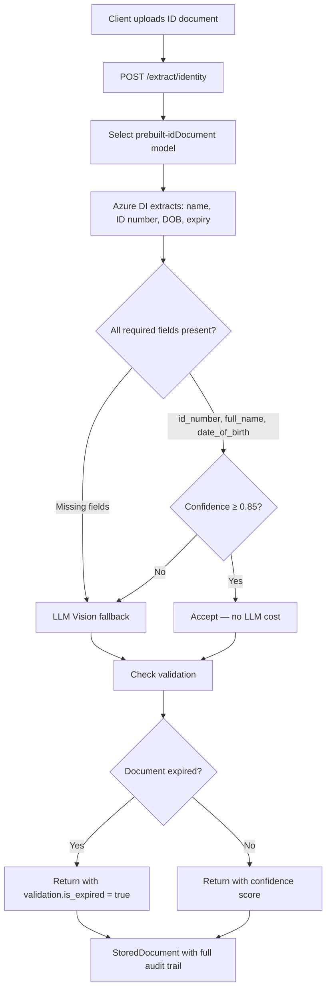
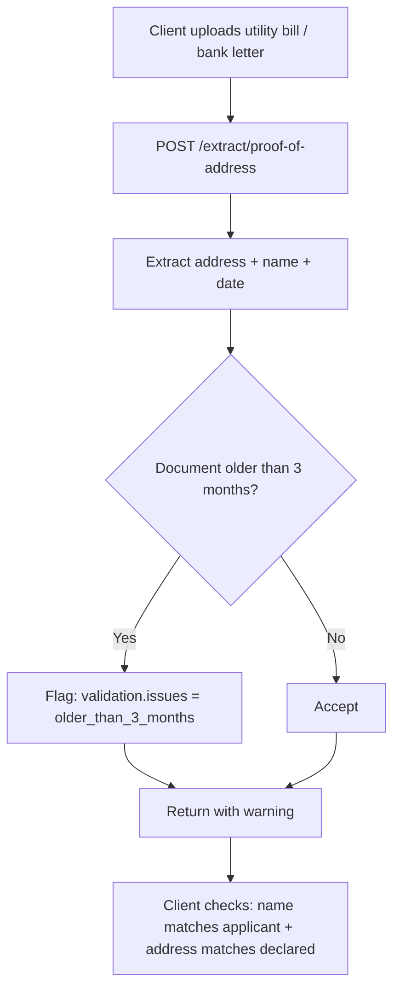
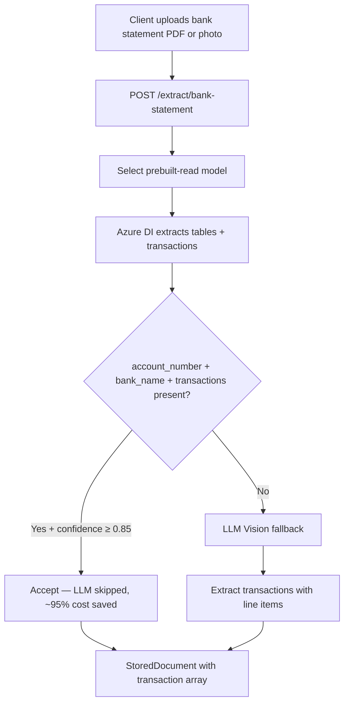
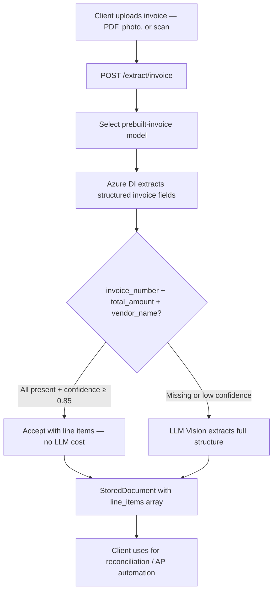
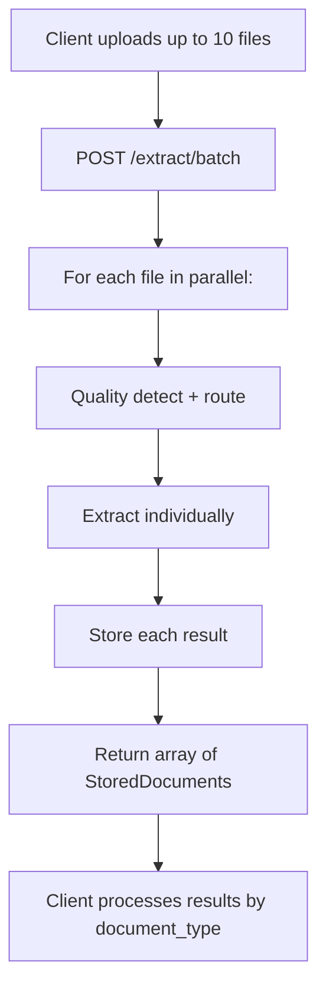
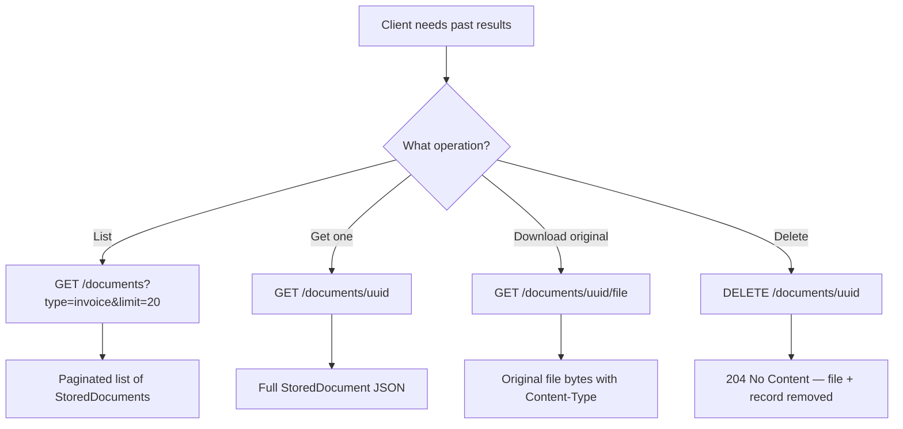
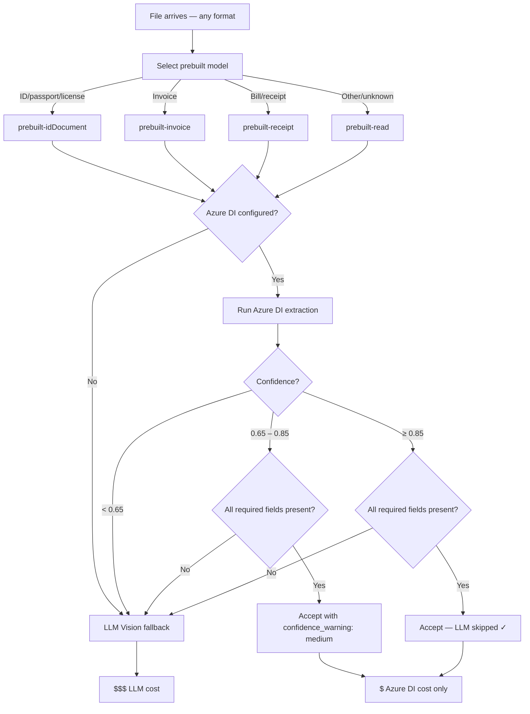

# Document Intelligence API

A FICA/KYC document intelligence service that extracts structured data from identity documents, proof of address, bank statements, payslips, invoices, and bills using LLM vision with cost-optimised routing.

Two implementations: **Python/FastAPI** and **.NET 9** — identical endpoints and output schemas.

---

## Architecture

```
                         ┌─────────────────────────────────────┐
                         │         Extraction Pipeline          │
  File Upload ──────────►│                                      │
                         │  1. Select prebuilt model            │
                         │     ├─ ID/passport → prebuilt-idDoc  │
                         │     ├─ Invoice    → prebuilt-invoice │
                         │     ├─ Bill/receipt→ prebuilt-receipt │
                         │     └─ Other      → prebuilt-read    │
                         │                                      │
                         │  2. Azure DI first (all doc types)   │
                         │     ├─ High confidence + complete ✓  │
                         │     │    └─► Accept (no LLM)         │
                         │     └─ Low confidence / missing      │
                         │          └─► LLM Vision fallback     │
                         └────────────┬────────────────────────┘
                                      │
                    ┌─────────────────▼──────────────────┐
                    │           LLM Providers             │
                    │  anthropic │ aitrium │ bedrock      │
                    │  openai    │ mock (dev)              │
                    └─────────────────┬──────────────────┘
                                      │
                    ┌─────────────────▼──────────────────┐
                    │         StoredDocument              │
                    │  file + extraction + audit trail    │
                    └──────┬──────────────┬──────────────┘
                           │              │
                    ┌──────▼──────┐  ┌───▼────────┐
                    │ Repository  │  │  File Store │
                    │ (SQLite /   │  │  (local /   │
                    │  Cosmos /   │  │  Azure Blob)│
                    │  SQL / ...)  │  └────────────┘
                    └─────────────┘
```

---

## Use Case Flows

### 1. Single Document Extraction (Auto-detect)



### 2. Identity Verification (KYC)



### 3. Proof of Address Verification



### 4. Bank Statement Processing



### 5. Invoice / Bill Processing



### 6. Batch Processing



### 7. Document Retrieval and Management



### 8. Adaptive Cost Routing Decision Tree



---

## Quick Start (Dev — no API keys needed)

### Python

```bash
# Install dependencies
python -m venv .venv && source .venv/bin/activate
pip install -r requirements-dev.txt

# Run (auto-uses mock provider when no keys configured)
uvicorn app.main:app --reload --port 8000

# Test
curl http://localhost:8000/health
curl -X POST http://localhost:8000/extract -F "file=@/path/to/document.pdf" | python -m json.tool
```

### .NET

```bash
cd dotnet/DocumentIntelligence.Api

# Run (auto-uses mock in Development mode)
dotnet run

# Test
curl http://localhost:5118/health
curl -X POST http://localhost:5118/extract -F "file=@/path/to/document.pdf" | python -m json.tool
```

No `.env` or secrets needed for dev — the service auto-detects that no credentials are configured and uses the mock provider.

---

## Supported Documents

| Type | Subtypes |
|------|----------|
| Identity Documents | National ID, Passport, Driver's License, Temporary ID, Asylum Permit |
| Proof of Address | Utility bill, Bank letter, Lease agreement, Municipal account, Insurance letter, Government letter, Tax document |
| Bank Statements | Current account, Savings account, Credit card, Loan statement |
| Payslips | Monthly payslip, Annual tax certificate, Employment letter |
| Invoices | Commercial invoice, Proforma invoice, Tax invoice |
| Bills | Phone bill, Medical bill, Subscription, Other bill |

---

## Endpoints

| Method | Path | Description |
|--------|------|-------------|
| `GET` | `/health` | Health check |
| `POST` | `/extract` | Auto-detect document type |
| `POST` | `/extract/identity` | Identity documents |
| `POST` | `/extract/bank-statement` | Bank statements |
| `POST` | `/extract/proof-of-address` | Proof of address |
| `POST` | `/extract/payslip` | Payslips |
| `POST` | `/extract/invoice` | Invoices |
| `POST` | `/extract/bill` | Bills |
| `POST` | `/extract/batch` | Batch (up to 10 files) |
| `GET` | `/documents` | List stored results |
| `GET` | `/documents/{id}` | Get extraction by ID |
| `GET` | `/documents/{id}/file` | Download original uploaded file |
| `DELETE` | `/documents/{id}` | Delete record and file |

### Form fields (all `/extract*` endpoints)

| Field | Type | Default | Description |
|-------|------|---------|-------------|
| `file` | file | required | PDF or image (jpg, png, tiff, bmp, webp) |
| `document_type` | string | `auto` | Type hint: `auto`, `identity_document`, `proof_of_address`, `bank_statement`, `payslip`, `invoice`, `bill` |
| `provider` | string | config | Override: `anthropic`, `aitrium`, `bedrock`, `openai`, `mock` |
| `model` | string | default | Model ID override |
| `hint` | string | — | Additional guidance (e.g. "South African ID") |
| `use_vision` | bool | `true` | Use LLM vision |

### Query params for `GET /documents`

| Param | Default | Description |
|-------|---------|-------------|
| `type` | — | Filter by document_type |
| `limit` | 100 | Page size |
| `offset` | 0 | Pagination offset |

---

## API Response

Every extraction returns a `StoredDocument`:

```json
{
  "id": "a1b2c3d4-1234-...",
  "filename": "invoice.pdf",
  "file_size_bytes": 245120,
  "file_content_type": "application/pdf",
  "storage_path": "uploads/a1b2c3d4-.../invoice.pdf",
  "uploaded_at": "2026-08-23T14:30:00Z",
  "processed_at": "2026-08-23T14:30:01Z",
  "processing_duration_ms": 1240,
  "provider_used": "AitriumProvider",
  "model_used": "arn:aws:bedrock:...",
  "page_count": 2,
  "document_type": "invoice",
  "document_subtype": "tax_invoice",
  "title": "Invoice INV-2024-001",
  "confidence": 0.94,
  "quality": { "readable": true, "issues": [] },
  "content": {
    "vendor_name": "Acme Corp",
    "invoice_number": "INV-2024-001",
    "invoice_date": "2024-01-15",
    "total_amount": 11400.00,
    "currency": "ZAR",
    "line_items": [
      { "description": "Consulting services", "quantity": 10, "unit_price": 1140, "amount": 11400 }
    ]
  },
  "validation": { "is_expired": null, "expiry_date": null, "issues": [] },
  "extraction_metadata": {
    "strategy_used": "adaptive",
    "quality_tier": "digital_pdf",
    "tier": "azure_di",
    "llm_skipped": true,
    "tier1_confidence": 0.94,
    "field_completeness": true,
    "missing_fields": [],
    "estimated_cost_savings": "~95% vs LLM vision"
  }
}
```

---

## Provider Configuration

### Anthropic (direct API)

**Python:**
```env
DEFAULT_LLM_PROVIDER=anthropic
ANTHROPIC_API_KEY=sk-ant-api03-...
```

**.NET:**
```bash
dotnet user-secrets set "LlmSettings:DefaultProvider" "anthropic"
dotnet user-secrets set "LlmSettings:AnthropicApiKey" "sk-ant-api03-..."
```

### Aitrium (gateway proxy)

**Python:**
```env
DEFAULT_LLM_PROVIDER=aitrium
AITRIUM_BASE_URL=https://your-gateway-url/v1/claude
AITRIUM_AUTH_TOKEN=your-base64-token
AITRIUM_MODEL=your-model-id-or-arn
```

**.NET:**
```bash
dotnet user-secrets set "LlmSettings:DefaultProvider" "aitrium"
dotnet user-secrets set "LlmSettings:AitriumBaseUrl" "https://your-gateway-url/v1/claude"
dotnet user-secrets set "LlmSettings:AitriumAuthToken" "your-base64-token"
dotnet user-secrets set "LlmSettings:AitriumModel" "your-model-id-or-arn"
```

### AWS Bedrock

**Python:**
```env
DEFAULT_LLM_PROVIDER=bedrock
BEDROCK_REGION=eu-central-1
BEDROCK_MODEL=anthropic.claude-sonnet-4-20250514-v1:0
BEDROCK_ACCESS_KEY=AKIA...
BEDROCK_SECRET_KEY=...
```

**.NET:**
```bash
dotnet user-secrets set "LlmSettings:DefaultProvider" "bedrock"
dotnet user-secrets set "LlmSettings:BedrockRegion" "eu-central-1"
dotnet user-secrets set "LlmSettings:BedrockAccessKey" "AKIA..."
dotnet user-secrets set "LlmSettings:BedrockSecretKey" "..."
```

---

## Extraction Strategies

```
EXTRACTION_STRATEGY=adaptive  (default, recommended)
```

| Strategy | Cost | Quality | Use when |
|----------|------|---------|----------|
| `adaptive` | lowest overall | high | Default — ALL docs through Azure DI first, LLM only as fallback |
| `llm_only` | highest | highest | Max accuracy needed |
| `azure_di_first` | low for structured docs | high | Same as adaptive (alias) |
| `ocr_first` | very low | medium | Speed/cost priority |
| `hybrid` | high | highest + validated | Compliance, audit |

### Prebuilt Model Selection (adaptive strategy)

| Document Type | Azure DI Model | Cost/page |
|---------------|----------------|-----------|
| Identity (ID, passport, license) | `prebuilt-idDocument` | ~$0.01 |
| Invoice | `prebuilt-invoice` | ~$0.01 |
| Bill / Receipt | `prebuilt-receipt` | ~$0.01 |
| Other (bank statement, payslip, proof of address) | `prebuilt-read` | ~$0.001 |
| LLM Vision (fallback only) | Claude / GPT-4o | ~$0.01–0.03 + tokens |

To use Azure DI strategies, configure:
```env
AZURE_DI_ENDPOINT=https://your-instance.cognitiveservices.azure.com/
AZURE_DI_KEY=your-key
CONFIDENCE_THRESHOLD=0.85
```

---

## Persistence Backends

```env
PERSISTENCE_BACKEND=sqlite  # default
```

| Backend | Value | Notes |
|---------|-------|-------|
| In-memory | `memory` | Dev default, no persistence |
| SQLite | `sqlite` | Production default, `documents.db` |
| Cosmos DB | `cosmos` | Stub — ready to implement |
| SQL Server | `sql` | Stub — ready to implement |
| Azure Table Storage | `table_storage` | Stub — ready to implement |

---

## Running Tests

### Python

```bash
source .venv/bin/activate
pytest                           # all tests
pytest tests/ -v                 # verbose
pytest tests/test_api.py -v      # API endpoint tests
pytest tests/test_providers.py   # provider factory tests
pytest tests/test_repository.py  # repository tests
```

### .NET

```bash
dotnet test dotnet/DocumentIntelligence.Tests/
```

---

## Docker

> Container support coming soon. The service is designed to run with:
> - `DOTNET_ENVIRONMENT=Production` or `PYTHON_ENV=production`
> - All secrets injected via environment variables
> - A mounted volume or Azure Blob for file storage
> - SQLite volume mount or Cosmos DB for persistence

---

## External Dependencies

- **Tesseract OCR** — required for image extraction: `brew install tesseract` / `apt install tesseract-ocr`
- **PyMuPDF** — PDF parsing (no external binary needed)
- **Azure Document Intelligence** — optional, for `azure_di_first` and `adaptive` strategies
